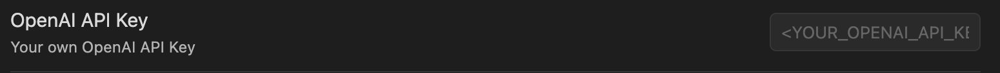
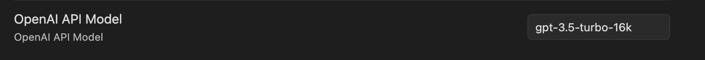

# Obsidian GPT

[installation-instructions]: https://help.obsidian.md/Advanced+topics/Third-party+plugins#Discover+and+install+community+plugins

This plugin lets the user Q&A with their own notes, powered by OpenAI.

## Features

- User can ask question about their own notes in Vaults in the plugin's side panel. The plugin will find the paragraph with the closet meaning and answer your question with your own notes as context for the answer.
- The plugin will also link the user to that particular note location.
- **NOTE**: The current _0.1._ version only exposes a simple sidebar with functionality similar to ChatGPT, it does not support reading through notes yet.

## Installation

Install the plugin via the [Community Plugins][installation-instructions] tab within Obsidian

## Getting started

### Obtaining your OpenAI API Key

- Refer to [this guide](https://www.maisieai.com/help/how-to-get-an-openai-api-key-for-chatgpt) to create OpenAI account and get your OpenAI API Key.
- Put your OpenAI API Key in the setting tab of the plugin.

### Choosing OpenAI Model

- Refer to [this docs](https://platform.openai.com/docs/models/overview) to choose the appropriate model for your use case.
- Put your chosen model in the setting tab of the plugin.

## Issues

- Please submit your issues [here](https://github.com/dangchinh25/obsidian-gpt/issues).
- All issues will be carefully reviewed and worked on in a timely manner.
